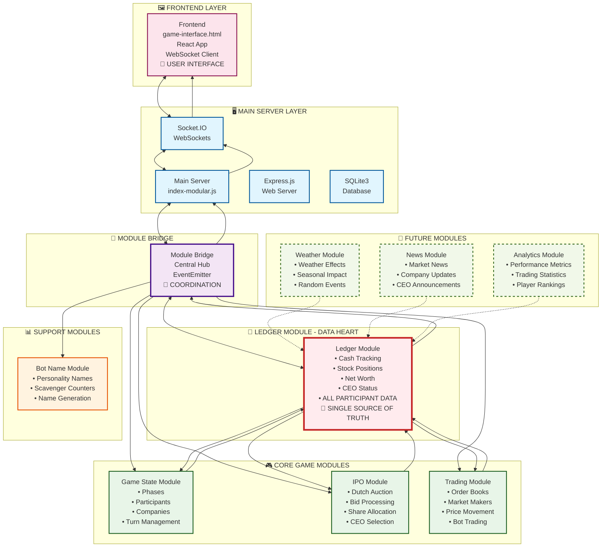
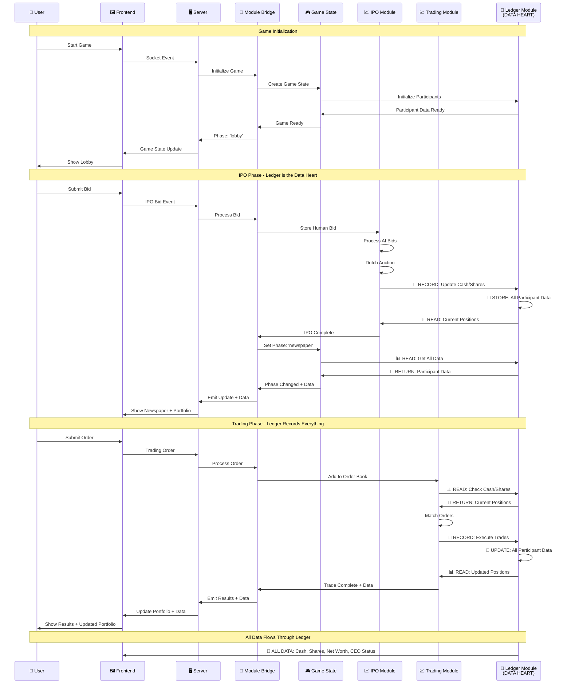
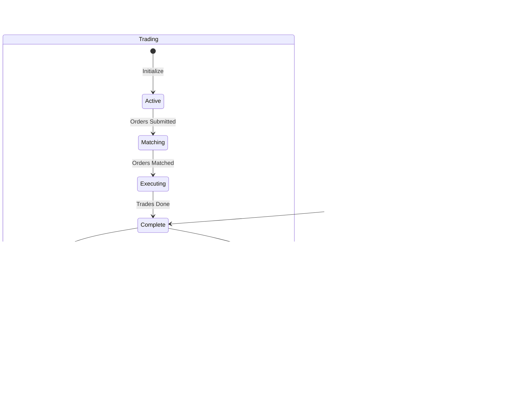

# Module Architecture - Mermaid Diagram

```mermaid
graph TB
    %% Frontend - The User Interface
    subgraph "🖼️ FRONTEND LAYER"
        FE[Frontend<br/>game-interface.html<br/>React App<br/>WebSocket Client<br/>📱 USER INTERFACE]
    end
    
    %% Main Server Layer
    subgraph "🖥️ MAIN SERVER LAYER"
        MS[Main Server<br/>index-modular.js]
        EX[Express.js<br/>Web Server]
        SO[Socket.IO<br/>WebSockets]
        DB[SQLite3<br/>Database]
    end
    
    %% Module Bridge
    subgraph "🌉 MODULE BRIDGE"
        MB[Module Bridge<br/>Central Hub<br/>EventEmitter<br/>🔄 COORDINATION]
    end
    
    %% LEDGER - THE HEART OF ALL DATA
    subgraph "💎 LEDGER MODULE - DATA HEART"
        LM[Ledger Module<br/>• Cash Tracking<br/>• Stock Positions<br/>• Net Worth<br/>• CEO Status<br/>• ALL PARTICIPANT DATA<br/>💾 SINGLE SOURCE OF TRUTH]
    end
    
    %% Core Game Modules
    subgraph "🎮 CORE GAME MODULES"
        GS[Game State Module<br/>• Phases<br/>• Participants<br/>• Companies<br/>• Turn Management]
        IPO[IPO Module<br/>• Dutch Auction<br/>• Bid Processing<br/>• Share Allocation<br/>• CEO Selection]
        TM[Trading Module<br/>• Order Books<br/>• Market Makers<br/>• Price Movement<br/>• Bot Trading]
    end
    
    %% Support Modules
    subgraph "📊 SUPPORT MODULES"
        BN[Bot Name Module<br/>• Personality Names<br/>• Scavenger Counters<br/>• Name Generation]
    end
    
    %% Future Modules
    subgraph "🔮 FUTURE MODULES"
        WM[Weather Module<br/>• Weather Effects<br/>• Seasonal Impact<br/>• Random Events]
        NM[News Module<br/>• Market News<br/>• Company Updates<br/>• CEO Announcements]
        AM[Analytics Module<br/>• Performance Metrics<br/>• Trading Statistics<br/>• Player Rankings]
    end
    
    %% CORRECTED CONNECTIONS - Everything flows through Ledger
    FE <--> SO
    SO <--> MS
    MS <--> MB
    
    %% All modules read from and write to Ledger
    MB <--> LM
    GS --> LM
    IPO --> LM
    TM --> LM
    
    %% Module Bridge coordinates everything
    MB --> GS
    MB --> IPO
    MB --> TM
    MB --> BN
    
    %% Ledger provides data to all modules
    LM --> GS
    LM --> IPO
    LM --> TM
    
    %% Future connections (dotted) - all will use Ledger
    WM -.-> LM
    NM -.-> LM
    AM -.-> LM
    
    %% Data flow back to frontend
    LM --> MB
    MB --> MS
    MS --> SO
    SO --> FE
    
    %% Styling
    classDef serverClass fill:#e1f5fe,stroke:#01579b,stroke-width:2px
    classDef bridgeClass fill:#f3e5f5,stroke:#4a148c,stroke-width:3px
    classDef ledgerClass fill:#ffebee,stroke:#c62828,stroke-width:4px
    classDef coreClass fill:#e8f5e8,stroke:#1b5e20,stroke-width:2px
    classDef supportClass fill:#fff3e0,stroke:#e65100,stroke-width:2px
    classDef frontendClass fill:#fce4ec,stroke:#880e4f,stroke-width:2px
    classDef futureClass fill:#f1f8e9,stroke:#33691e,stroke-width:2px,stroke-dasharray: 5 5
    
    class MS,EX,SO,DB serverClass
    class MB bridgeClass
    class LM ledgerClass
    class GS,IPO,TM coreClass
    class BN supportClass
    class FE frontendClass
    class WM,NM,AM futureClass
```

## Data Flow Diagram

```mermaid
sequenceDiagram
    participant U as 👤 User
    participant F as 🖼️ Frontend
    participant S as 🖥️ Server
    participant MB as 🌉 Module Bridge
    participant GS as 🎮 Game State
    participant IPO as 📈 IPO Module
    participant TM as 💹 Trading Module
    participant LM as 💎 Ledger Module<br/>(DATA HEART)
    
    Note over U,LM: Game Initialization
    U->>F: Start Game
    F->>S: Socket Event
    S->>MB: Initialize Game
    MB->>GS: Create Game State
    GS->>LM: Initialize Participants
    LM->>GS: Participant Data Ready
    GS->>MB: Game Ready
    MB->>S: Phase: 'lobby'
    S->>F: Game State Update
    F->>U: Show Lobby
    
    Note over U,LM: IPO Phase - Ledger is the Data Heart
    U->>F: Submit Bid
    F->>S: IPO Bid Event
    S->>MB: Process Bid
    MB->>IPO: Store Human Bid
    IPO->>IPO: Process AI Bids
    IPO->>IPO: Dutch Auction
    IPO->>LM: 💾 RECORD: Update Cash/Shares
    LM->>LM: 💾 STORE: All Participant Data
    LM->>IPO: 📊 READ: Current Positions
    IPO->>MB: IPO Complete
    MB->>GS: Set Phase: 'newspaper'
    GS->>LM: 📊 READ: Get All Data
    LM->>GS: 💾 RETURN: Participant Data
    GS->>MB: Phase Changed + Data
    MB->>S: Emit Update + Data
    S->>F: Show Newspaper + Portfolio
    
    Note over U,LM: Trading Phase - Ledger Records Everything
    U->>F: Submit Order
    F->>S: Trading Order
    S->>MB: Process Order
    MB->>TM: Add to Order Book
    TM->>LM: 📊 READ: Check Cash/Shares
    LM->>TM: 💾 RETURN: Current Positions
    TM->>TM: Match Orders
    TM->>LM: 💾 RECORD: Execute Trades
    LM->>LM: 💾 UPDATE: All Participant Data
    LM->>TM: 📊 READ: Updated Positions
    TM->>MB: Trade Complete + Data
    MB->>S: Emit Results + Data
    S->>F: Update Portfolio + Data
    F->>U: Show Results + Updated Portfolio
    
    Note over U,LM: All Data Flows Through Ledger
    LM->>F: 💾 ALL DATA: Cash, Shares, Net Worth, CEO Status
```

## Phase Flow Diagram

```mermaid
stateDiagram-v2
    [*] --> Lobby: Game Start
    
    Lobby --> IPO: Start Game
    IPO --> Newspaper: IPO Complete
    Newspaper --> Trading: Ready Button
    Trading --> Newspaper: Trading Complete
    Newspaper --> Trading: Ready Button
    Trading --> [*]: Game End
    
    state IPO {
        [*] --> Waiting: Initialize
        Waiting --> Processing: Human Bid
        Processing --> Complete: Dutch Auction
        Complete --> [*]: All Companies Done
    }
    
    state Trading {
        [*] --> Active: Initialize
        Active --> Matching: Orders Submitted
        Matching --> Executing: Orders Matched
        Executing --> Complete: Trades Done
        Complete --> [*]: Round Complete
    }
    
    state Newspaper {
        [*] --> Display: Show Results
        Display --> [*]: Ready for Next
    }
```
